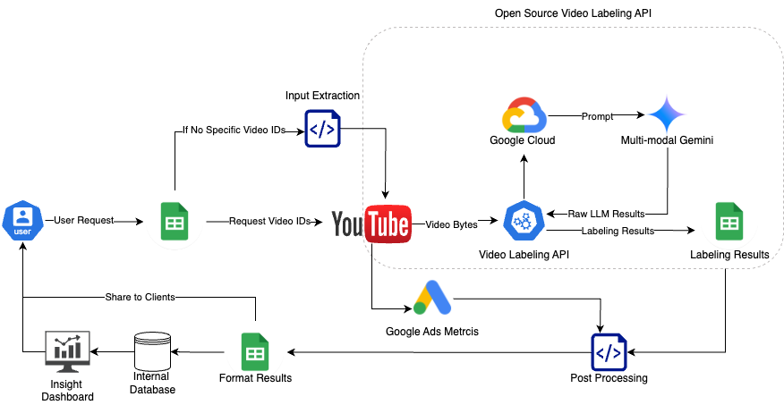

<h1 align="left" style="line-height: 25px;">
  &nbsp;&nbsp;&nbsp;
  <span style="vertical-align: middle; margin-left: 10px;">GrCN Gaming Video Labeling Tool</span>
</h1>


## Disclaimer

This is not an official Google product.

Copyright 2025 Google LLC. Supported by Google LLC and/or its affiliate(s). This solution, including any related sample code or data, is made available on an “as is,” “as available,” and “with all faults” basis, solely for illustrative purposes, and without warranty or representation of any kind.

This solution is experimental, unsupported and provided solely for your convenience. Your use of it is subject to your agreements with Google, as applicable, and may constitute a beta feature as defined under those agreements. To the extent that you make any data available to Google in connection with your use of the solution, you represent and warrant that you have all necessary and appropriate rights, consents and permissions to permit Google to use and process that data. By using any portion of this solution, you acknowledge, assume and accept all risks, known and unknown, associated with its usage and any processing of data by Google, including with respect to your deployment of any portion of this solution in your systems, or usage in connection with your business, if at all.

With respect to the entrustment of personal information to Google, you will verify that the established system is sufficient by checking Google's privacy policy and other public information, and you agree that no further information will be provided by Google.

This is a tool that leverage Google Cloud's Vertex AI and Google's Multimodal models to enable clients locally process and categorize gaming YouTube video assets based on a predefined set of tags. By using this tool, you acknowledge that the output is generated based on the provided implementation and may not always be accurate or complete. Please use the tagged information responsibly and verify it as needed. This tool is developed by Google Ads gPS GrCN team. Please contact your gPSer if you have any questions.

## Introduction:

**Welcome to the GrCN Gaming Video Tagging Tool!**

The GrCN Gaming Video Tagging Tool is a solution designed to streamline the process of tagging video content for the GrCN Gaming initiative. It is designed to enable our clients to efficiently analyze and categorize video content locally based on predefined criteria. This tool utilize Google Sheets API, Google Cloud Storage, Vertex AI API and additionally, yt-dlp for downloading YouTube videos. This solution uses the client libraries mentioned above to interact with the respective Google Cloud services. This solution can be easily deployed for both developers and users.

**Full gTech video labeling solution offering workflow**



## Architecture

The GrCN Gaming Video Tagging Tool employs a modular architecture to facilitate the video tagging process. This solution consists of the following key components:

1.  **Data Ingestion:** The tool reads a list of video identifiers from a specified Google Sheet.
2.  **Video Processing:** For each video identifier, the tool downloads the corresponding video content.
3.  **AI-Powered Tagging:** The downloaded video is then analyzed powered by Google's Gemini model to analyze corresponding tags based on the video content.
4.  **Result Output:** The generated tags for each video are then written back to the original Google Sheet in a designated output sheet.

This solution allows users to easily manage and process video tagging tasks in a scalable and efficient manner, directly from their local environment.

## Getting Started

This guide will walk you through the installation and execution of the video tagging script. Please ensure you have the necessary prerequisites installed before proceeding.

## Prerequisites

Before you begin, ensure you have the following installed and configured:

* **gCloud CLI:** The Google Cloud Command Line Interface. Follow the installation instructions on the [Install gcloud page](https://cloud.google.com/sdk/docs/install).
* **Google Account with Project Access:** You will need a Google account with access to the relevant Google Cloud Project for billing and quota [gcloud auth login](https://cloud.google.com/sdk/gcloud/reference/auth/login).

## Installation

Follow these steps to install the necessary components and set up the tool:

1.  **Download the Script:**
    Download the video tagging script folder: [GAMING TAG API](https://drive.google.com/drive/folders/10yZoT1Q6bki1GW1hh_RkPmOS8Jd9nGVI?resourcekey=0-6CvZvey_PjoUZa5lDXWwUQ&usp=drive_link).

2.  **Set up gCloud:**
    * Install the gCloud CLI as per the instructions on the [Install gcloud page](https://cloud.google.com/sdk/docs/install).
    * Log in to your Google account using the gCloud CLI:
        ```bash
        gcloud auth login --enable-gdrive-access --update-adc
        ```
        Follow the prompts to authenticate.
    * Set your Google Cloud Project for billing and quota:
        ```bash
        gcloud auth application-default set-quota-project [YOUR GCP Project Name]
        ```
        Replace `[YOUR GCP Project Name]` with your actual Google Cloud Project ID.

3.  **Install `google-api-python-client`:**
    Install the required Python library using pip:
    ```bash
    pip3 install --upgrade google-api-python-client
    ```
    Refer to the [Google-api-python-client documentation](https://developers.google.com/api-client-library/python/start/installation) for more details.

4.  **Create OAuth 2.0 Credentials:**
    * Go to the [Google Cloud APIs & Services](https://console.cloud.google.com/apis/dashboard) page.
    * Navigate to "Credentials."
    * Click on "+ Create credentials" and select "OAuth client ID."
    * Choose the "Desktop app" as the Application type and give it a name. Click "Create."
    * Click the "Download JSON" button to download the client secret JSON file. Securely store this file in a local folder.

5.  **Set up gSpread Credentials:**
    * Create a directory for gSpread credentials:
        ```bash
        mkdir -p ~/.config/gspread
        ```
    * Move the downloaded client secret JSON file to the gSpread credentials directory and rename it to `credentials.json`:
        ```bash
        mv <PATH_TO_YOUR_CREDENTIALS> ~/.config/gspread/credentials.json
        ```
        Replace `<PATH_TO_YOUR_CREDENTIALS>` with the actual path to the downloaded JSON file.

## Configuration

1.  **Spreadsheet Configuration:**
    The tool is configured to read video IDs from the Google Sheet specified by the `SPREADSHEET_ID` and `SHEET_NAME` in the `video_label_config/compass_gemini_config.py` file. The output results will be written to a new sheet named `[Result]` followed by the original sheet name. Ensure the input spreadsheet exists and you have the necessary permissions. The script looks for video IDs in the column specified by `SHEET_COLUMN_NAME_TO_READ` in the configuration file.
    
    ```python
    #[User-defined] Input Video Google Spreadsheet
    SPREADSHEET_ID = '[YOUR_SPREADSHEET_ID]'
    SHEET_NAME = '[YOUR_SPREADSHEET_NAME]'
    SHEET_COLUMN_NAME_TO_READ = 'video_id'
    OUTPUT_SHEET_NAME = '[Result][YOUR_SPREADSHEET_NAME]'
    ```

2.  **Client Secret Configuration:**
    Your downloaded client secret JSON file should contain your `client_id`, `project_id`, and `client_secret`. Ensure these values are correctly present in the `~/.config/gspread/credentials.json` file. An example of the JSON file structure is as follows:
    ```json
    {
      "installed": {
        "client_id": "[YOUR GCP Project Name]",
        "project_id": "[YOUR GCP Project Name]",
        "auth_uri": "[https://accounts.google.com/o/oauth2/auth](https://accounts.google.com/o/oauth2/auth)",
        "token_uri": "[https://oauth2.googleapis.com/token](https://oauth2.googleapis.com/token)",
        "auth_provider_x509_cert_url": "[https://www.googleapis.com/oauth2/v1/certs](https://www.googleapis.com/oauth2/v1/certs)",
        "client_secret": "[YOUR CLIENT SECRET]",
        "redirect_uris": ["urn:ietf:wg:oauth:2.0:oob", "http://localhost"]
      }
    }
    ```
    Replace `[YOUR GCP Project Name]` and `[YOUR CLIENT SECRET]` with your actual project ID and client secret.

3.  **Configuration File (`compass_gemini_config.py`):**
    Review and update the configuration file (`video_label_config/compass_gemini_config.py`) with your specific Google Cloud Project details, Cloud Storage bucket name, spreadsheet ID, sheet name, column name for video IDs, and the desired Gemini model prompt.

## Usage

1.  **Navigate to the script directory** in your terminal.

2.  **Install dependencies** by running the following command:
    ```bash
    pip3 install --upgrade -r requirements.txt
    ```

3.  **Run the video tagging script:**
    ```bash
    python3 gemini_cli.py
    ```

4.  **View Results:**
    The output results of the video tagging process will be written to a new Google Sheet named `[Result]<SHEET_NAME>`.

## Google POCs

For any questions or issues, please contact:

* Da Li (daadali@google.com)
* Sisi Liu (sisiliu@google.com)
